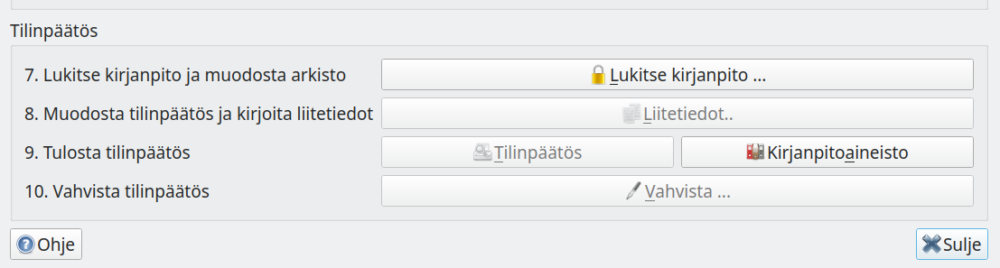
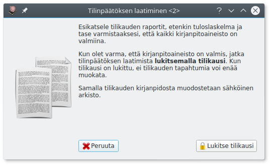
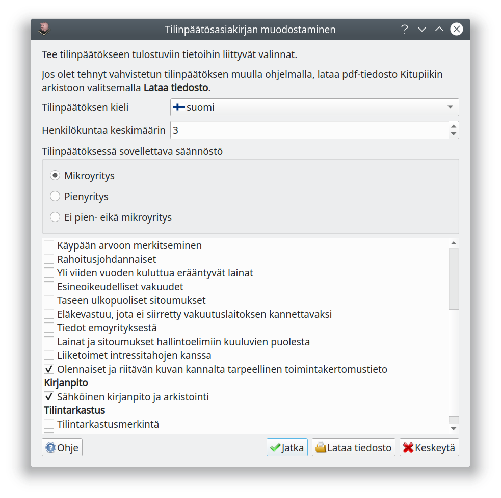
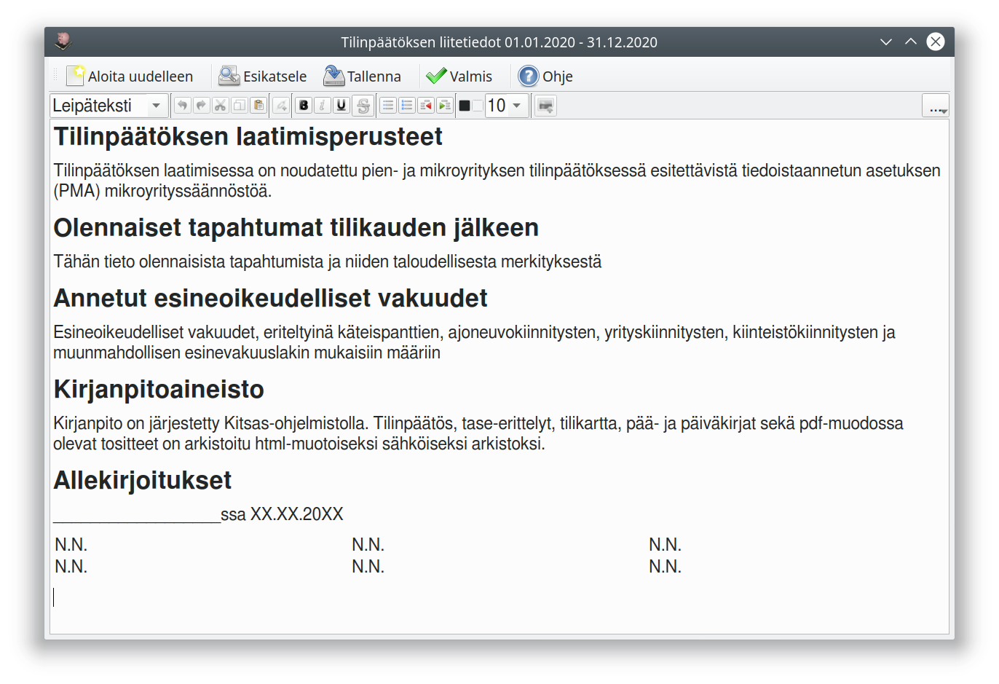
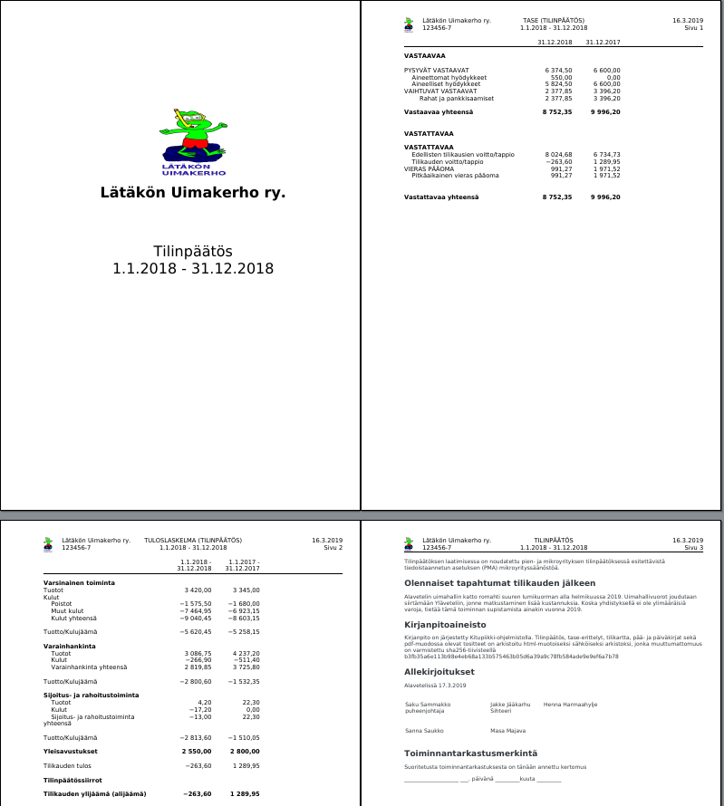
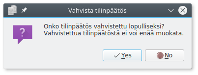

# Tilinpäätösasiakirjan laatiminen

## Kirjanpidon lukitseminen

Kun kirjanpito on valmis, lukitse tilikauden kirjanpito (**Lukitse kirjanpito**-painike).

!!! warning "Lukittua kirjanpitoa ei voi enää muokata"
    Tässä vaiheessa kirjanpito lukitaan, eikä sitä voi enää muokata. Huolehdi siksi, että kaikki tilikaudelle kuuluvat kirjaukset on tehty!

## Tilinpäätösasiakirjan muodostaminen

Kitsaan tilikartat sisältävät tilinpäätöksen ja liitetietojen rungon. **Tilinpäätös**-painikkeella pääset tekemään tilinpäätökseen liittyvät valinnat.

Kitsas pystyy pääsääntöisesti päättelemään liikevaihdon, taseen ja henkilökuntamäärän perusteella, voidaanko tilinpäätös laatia mikro- tai pienyrityssäännösten mukaisesti.

!!! success "Mikroyrityksen suojasatama"
    Mikrokoon yritykselle riittää, että liitetietona annetaan vain nimeomaisesti luetellut (listalla olevat) asiat. Laatimisperiaatteet ilmoitetaan vain niiltä osin, kun ne poikkeavat asetuksessa esitetyistä oletuksista. Muiden yritysten on annettava liitetietona myös muut seikat, jotka ovat tarpeen oikean ja riittävän kuvan aikaansaamiseksi.

Tehtyäsi valinnat paina **Jatka**.

Jos laadit tilinpäätöksen jolloin muulla ohjelmalla (kuten tekstinkäsittelyohjelma), voit tallentaa pdf-muotoisen tilinpäätöksen Kitupiikin sähköiseen arkistoon valitsemalla **Lataa tiedosto**.

Täydennä liitetiedot ohjelman laatimista pohjateksteistä.

Jos valitset **Aloita uudelleen**, pääset tekemään uudestaan tilinpäätökseen liittyvät valinnat. **Esikatsele** ja **tallenna** tilinpäätös.

## Kirjanpitoaineisto

!!! bug "Windows tuottaa puutteellisen aineiston"
    Windowsilla sähköisten tositteiden sisällyttämisessä kirjanpitoaineistoon esiintyy puutteita.

Kitsas kokoaa koko sähköisessä muodossa olevan kirjanpitoaineiston (tilipäätöstä lukuun ottamatta) yhteen pdf-tiedostoon, joka avautuu **Kirjanpitoaineisto**-painikkeesta.

!!! note "Kirjanpidon säilyttäminen"
    Tilinpäätöstä ja kirjanpitoaineistoa on säilytettävä 10 vuotta tilikauden päättymisvuoden lopusta. Tositteita on säilytettävä kuusi vuotta. Kirjanpidon säilyttämisessä [sähköinen arkisto](/tilikaudet/arkisto) on ensisijainen vaihtoehto, koska se säilyttää
    kirjausketjun sekä kirjanpidon muokkaushistorian.

## Tilinpäätöksen vahvistaminen

Kun tilinpäätös on vahvistettu (hyväksytty yhdistyksen vuosikokouksessa, yhtiökokouksessa tms. taikka yhtiömiesten allekirjoittama), merkitse se vahvistetuksi tilinpäätösikkunan **Vahvista**-painikkeella.

Vahvistettua tilinpäätöstä ei enää pääse muokkaamaan, ja **Tilikaudet**-välilehden **Tilinpäätös**-painike ei enää avaa valintaikkunaa vaan tilinpäätöksen pdf-tiedoston.
