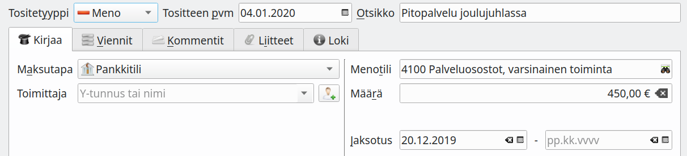
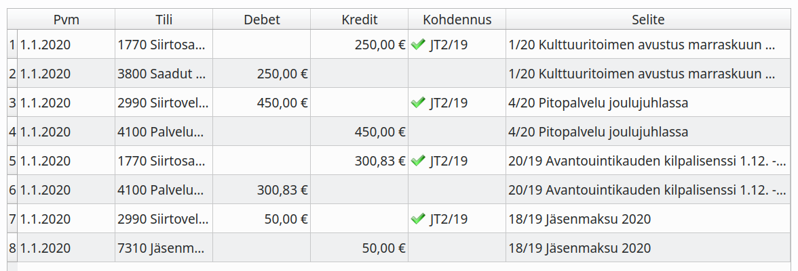

# Jaksotukset

Tilikauden aikana lasku- ja maksuperusteisesti tehdyt kirjaukset on oikaistava ennen tilinpäätöksen laatimista suoriteperusteisiksi.

!!! success "Vähäisiä kirjauksia ei tarvitse jaksottaa"
    Vähäisiä kirjauksia, jotka on tehty lasku- tai maksuperusteisesti, ei ole tarpeen oikaista ja täydentää suoriteperusteen mukaisiksi, ellei niiden yhteisvaikutus ole olennainen. (KPL 3. luku 4§)

    Esimerkiksi sähkö tms. laskuja, joiden laskutuskausi ulottuu tilikauden vaihteen ylitse, ei yleensä jaksoteta.

!!! note "Oikeus maksuperusteiseen tilinpäätökseen"
    Mikrokokoinen yhdistys saa laatia tilinpäätöksen maksuperusteisesti, mutta silloin sen on annettava ylimääräisiä liitetietoja. Samoin maksuperusteisen tilinpäätöksen saa laatia sellainen ammatin- ja elinkeinonharjoittaja, jolla ei ole velvollisuutta tilinpäätöksen laatimiseen.

Kirjanpidon jaksotukset tehdään siirtovelat ja siirtosaamiset -kirjanpitotileillä.

Kirjanpitotili  |  Käyttötarkoitus
----------------|------------------------
Siirtovelat     | Saatu maksu tuotteesta, joka toimitetaan vasta tulevaisuudessa tai otettu vastaan tuote, joka maksetaan vasta tulevaisuudessa
Siirtosaamiset  | Maksettu tuote, joka toimitetaan tulevaisuudessa tai toimitettu tuote, josta saadaan maksu tulevaisuudessa

## Automaattiset jaksotukset

Kitsas pystyy jaksottamaan tilinpäätöksen yhteydessä ne menot, jotka kirjaamisvaiheessa on merkitty jaksotetttaviksi. Samalla tehdään mahdollinen negatiivisen verovelan kirjaaminen tilinpäätöksessä verosaamisena.

Tee jaksotukset **Kirjaa jaksotukset** -painikkeella. Painike ei ole näkyvissä, mikäli tilikaudelle ei ole tulossa kirjattavia jaksotuksia.

## Jaksotusesimerkkejä

15.11.2019 saadaan seuraavalle vuodelle kuuluva jäsenmaksu, joka kirjataan maksuperusteisesti ja jaksotetaan.

30.11. maksetaan lisenssi avantouintikaudelle 1.12. - 31.3. joka kirjataan maksuperusteisesti. Jaksotuksen avulla maksusta noin &frac14; jää vuodelle 2019 (joulukuun osuus) ja &frac34; siirtyy vuodelle 2020 (kolme kuukautta). Jaksotus lasketaan päivän tarkkuudella.

!!! note "Muista olennaisuusperiaate"
    Yhdistyksen ei tarvitse välttämättä jaksottaa tällaista menoa.

    Esimerkiksi tietokoneohjelmiston ylläpitopalvelua tarjoavan tai lehtitilauksia myyvän yrityksen on kuitenkin jaksotettava tulo vastaavalla tavalla.

Yhdistys maksaa 4.1. laskun joulujuhlan tarjoiluista. Laskun olisi voinut myös kirjata suoriteperusteisesti joulukuulle ja sitten tammikuussa merkitä tiliotteelta maksetuksi.

Yhdistykselle myönnetään syksyllä 2019 avustus tapahtumaan, joka järjestetään 4.11. Avustus maksetaan yhdistyksen tilille kuitenkin vasta 15.1.

### Esimerkkien jaksotuskirjaukset

#### Tilinpäätöstyökalun jaksotusnäkymä
  

#### Jaksotuskirjaukset 31.12.
  

#### Jaksotusten purku 1.1.
  

!!! note "Tilikausien oltava avoimina"
    Automaattisia jaksotuskirjauksia voi tehdä vain silloin, kun tilinpäätöstä ei ole vielä laadittu. Jos esimerkiksi myönnettyä avustusta ei ole maksettu vielä silloin, kun tilinpäätöstä aloitetaan laatimaan, on avustus kirjattava siirtosaamiseksi ja kuitattava aikanaan siirtosaamisten tililtä.

    Kirjaa tarvittaessa muistiotositteina ne jaksotukset, joita et voi tehdä automatiikalla.
