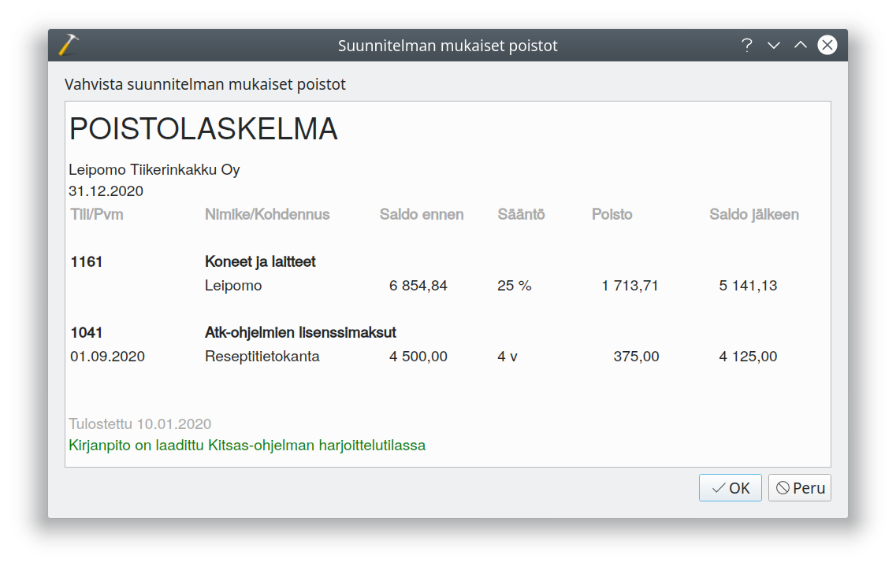

# Poistot

Hankittaessa rakennuksia, koneita, kalusteita tms. joita käytetään pidemmällä aikavälillä, ei niitä kirjata välittömästä menoiksi vaan hankinta kirjataan taseeseen, josta sitä poistetaan suunnitelman mukaisesti.

!!! note "Verottajan ohje"
    [Verohallinnon ohje käyttöomaisuuden poistoista](https://www.vero.fi/yritykset-ja-yhteisot/tietoa-yritysverotuksesta/tuloverotus/liikkeen-tai-ammatinharjoittaja/poistot-k%C3%A4ytt%C3%B6omaisuudesta/)

    Elinkeinotoiminnassa menona voi kirjata hankinnan, jonka taloudellinen käyttöaika on enintään kolme vuotta, sekä pienhankintana enintään 2 500 euron arvosta vuodessa niin, että yksittäinen hankinta maksaa enintään 850 euroa.

## Poistojen kirjaaminen

Kirjaa suunnitelman mukaiset poistot tilinpäätösikkunan **Kirjaa poistot**-painikkeella. Painike ei ole näkyvissä, mikäli tilikaudelle ei ole tulossa kirjattavia poistoja.

Kitsas näyttää poistolaskelman, jonka voit vahvistaa **Ok**-painikkeella.

!!! tip "Poistojen kohdentaminen"
    Kitsas tekee poistoista järjestelmätositteen. Jos poistoja on esimerkiksi tarpeen kohdentaa eri kohdennuksille, etsi **Selaa**-välilehdeltä poistotosite ja muokkaa sitä.

!!! note "Suunnitelman mukaiset poistot"    
    Kitsaan automaattinen poistotoiminto kirjaa poistot suunnitelman mukaisina. Yhdistyksillä on velvollisuus kirjata aina poistonsa suunnitelman mukaisesti, kun taas asunto-osakeyhtiöt voivat kirjata poistoja joustavasti ja elinkeinotoiminnassa saadaan erityisistä syistä kirjata suunnitelman ylittäviä poistoja. Tällaiset poikkeavat poistot on kirjattava itse poistotositetta muokkkaamalla.

!!! note "Korotetut poistot"
    Verovuosina 2020-2023 voi koneista, kalustoista, laitteista ja niihin verrattavasta uutena ostetusta irtaimesta käyttöomaisuudesta tehdä kaksinkertaisia poistoja, katso [verottajan ohje](https://www.vero.fi/syventavat-vero-ohjeet/ohje-hakusivu/82959/koneiden-ja-laitteiden-korotetut-poistot-verovuosina-2020-2023/). Nämä korotetut poistot pitää kirjata käsin joka kirjaamalla Kitsaan tekemän suunnitelman mukaisen poiston jälkeen erilliselle tositteelle poistojen korotettu osuus tai kirjaamalla poistot kokonaisuudessaan käsin.
