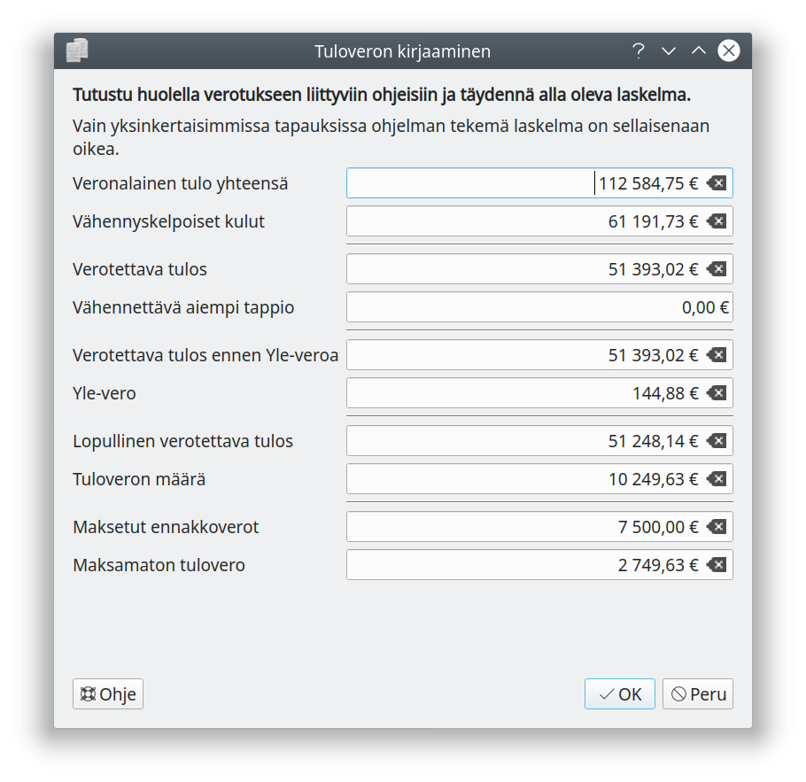
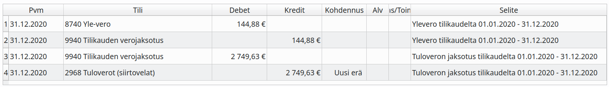

# Tulovero

Ennen kuin jatkat tuloveron kirjaamiseen, tarkasta kirjanpitosi tutkimalla kirjanpidon raportteja ja huolehdi erityisesti, että kirjanpidon tilit täsmäävät pankkitilien kanssa.

!!! success "Yleishyödyllisen yhdistyksen verovapaus"
    Yleishyödyllinen yhteisö, jolla ei ole elinkeinotoimintaa eikä kiinteistötuloja, ei yleensä maksa tuloveroa, katso tarkemmin [Verohallinnon ohje](https://www.vero.fi/yritykset-ja-yhteisot/tietoa-yritysverotuksesta/tuloverotus/yhdistys-ja-saatio/)

!!! note "Yrityksen vai yrittäjän tuloa"
    Avoimen yhtiön ja kommandiittiyhtiön tuloa verotetaan yhtiömiesten verotuksessa, samoin kuin liikkeen- ja ammatinharjoittajat.

Kitsaassa on toiminto osakeyhtiön ja osuuskunnan tuloveron kirjaamiseen. Osakeyhtiö ja osuuskunta laskee itse maksettavan veron määrän. Yrityksen on tarkoituksenmukaista hakea jo verovuoden aikana mahdollisimman oikean suuruista ennakkoveroa maksettavaksi.

Tilinpäätöstyökalun **Kirjaa tulovero** -painikkeella avautuu tuloveron laskennan ja kirjaamisen ikkuna.

!!! danger "Täydennä laskelma"
    Ohjelman tekemä laskelma on täsmälleen oikea vain kaikkein yksinkertaisimmissa tilanteissa. Jatka täyttämään tämä laskelma vasta kun olet tarkastanut kirjanpitosi ja selvittänyt sen pohjalta veroilmoituksessa tarvittavat tiedot.

Merkitse laskelmaan **verotettava tulo yhteensä** sekä **vähennyskelpoiset kulut ilman Yle-veroa**. Tarkista, että Yle-vero on laskettu oikein.

Tarkasta myös, että **tuloveron määrä** ja **maksetut ennakkoverot** on merkitty oikein.

!!! note "Eri tulolähteet"
    Vuonna 2020 päättyvien tilikausien verotuksessa osakeyhtiöillä ja osuuskunnilla (jotka eivät harjoita maataloutta) on pääsääntöisesti vain yksi tulonlähde. Esimerkiksi veroa maksavilla yhdistyksillä voi olla yhä useampia erikseen verotettavia tulolähteitä. Täydennä aina ohjelman laskelma!

Kun laskelma on valimis, paina **Ok**. Ohjelma tekee tuloverojen jaksotuskirjaukset. Liitä veroilmoitus ja mahdolliset laskelmat kirjanpitoaineistoon.

Yllä olevan esimerkin mukainen tuloveron jaksotuskirjaus

