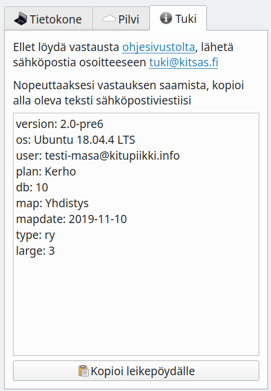

# Käyttäjätuki

## Maksuton käyttäjätuki

Kysy, kommentoi ja tee ehdotuksia Kitsaan ominaisuuksista osallistumalla näiden nettisivujen alalaidassa olevaan keskusteluun.

Kysymyksiin sivustolla voivat vastata kaikki Kitsaan käyttäjät. Myös ohjelman kehittäjät seuraavat sivuilla käytävää keskustelua ja osallistuvat siihen mahdollisuuksiensa mukaisesti.

Kirjoita kysymyksesi kommenttina sille sivulle, jossa käsitellään sinua askarruttavaa asiaa.

## Tilaajien henkilökohtainen neuvonta

!!! note "Ei lainopillista neuvontaa"
    Kitsaan antama tuki rajoittuu ohjelman käyttämiseen. Kitsas ei anna kirjanpitoon tai verotukseen liittyvää neuvontaa eikä takaa, että Kitsaan tuen antama neuvonta olisi kirjanpidon kannalta riittävää.

[Kitsaan maksullisiin tilauksiin](https://kitsas.fi/hinnat) sisältyy tarvittaessa myös sähköpostilla annettavaa neuvontaa. Sähköpostituki on myös muiden rekisteröityneiden käyttäjien saatavilla 30 päivän kokeilujakson ajan.

Ottaessasi yhteyttä Kitsaan tilaajien tukisähköpostiin *tuki@kitsas.fi* liitä (jos mahdollista)  sähköpostiviestiisi **Aloita**-sivun **Tuki**-välilehdellä olevat tiedot. Helpoiten teet sen valitsemalla Kitsaassa **Kopioi leikepöydälle** ja sähköpostissa **Liitä**.

Tukisivulla olevat tiedot helpottavat kysymykseesi vastaamista, koska näemme siitä mm. ohjelman ja tilikartan version. Ellet voi liittää näitä tietoja, tarkistamme tilauksesi voimassaolon sähköpostiosoitteesi perusteella.

## Palaute

Otamme kiitollisina vastaan palautetta ohjelmasta osoitteessa **palaute@kitsas.fi**. Palauteosoitteessa ei kuitenkaan anneta yleistä neuvontaa.

!!! info "Kitsas on avointa lähdekoodia"
    Kitsas Oy kehittää tätä ohjelmistoa yhteistyössä avoimen lähdekoodin yhteisön kanssa. Kuka tahansa voi ehdottaa ohjelmaan muutoksia [GitHub-palvelun](https://github.com/artoh/kitupiikki) kautta.
