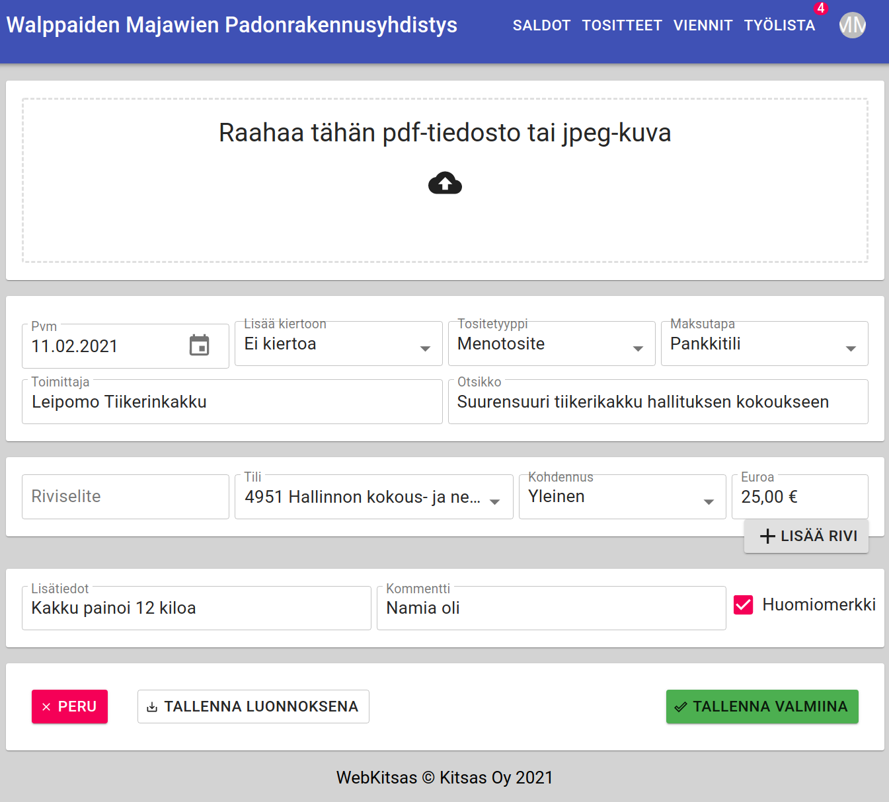

# WebKitsas

Kitsaan pilveen tallennettuihin kirjanpitoihin pääsee web-käyttöliittymällä osoitteessa [pilvi.kitsas.fi](https://pilvi.kitsas.fi)

!!! note "Vain rajoitetusti toimintoja"
    WebKitsaalla on vain pieni osa niistä toiminnoista, jotka ovat käytettävisään Kitsaan työpöytäohjelmistolla. WebKitsas on tarkoitettu lähinnä kirjanpidon selaamiseen sekä kierrossa olevien laskujen käsittelyyn niin, että esimerkiksi laskujen hyväksyjä ei välttämättä tarvitse Kitsas-ohjelmisto omalle tietokoneelleen.

## Kirjautuminen

WebKitsaaseen kirjaudutaan samalla sähköpostiosoitteella ja salasanalla kuin muutenkin Kitsaan pilveen.

## Saldonäkymä

Saldonäkymässä näet tilikauden saldot. Voit halutessasi tarkastella tulostilien saldoja myös haluamallasi kohdennuksella.

Napsauttamalla tilin numeroa näet tilille tehdyt kirjaukset, ja kirjauksista voit edetä edelleen tositteisiin saakka.

## Tositenäkymä

Tositenäkymässä voit selata tositteita, napsauttamalla riviä näet tositteen täydet tiedot.

## Työlista

Työlistalla näet ne tositteet, jotka ovat [sinulle määritellyissä kierroissa.](/maaritykset/kierto/). Napsauttamalla riviä pääset käsittelemään tositetta

Oikeuksista riippuen voit **tarkastaa** ja **hyväksyä** tositteen, jolloin se siirtyy kierrossa seuraavaan vaiheeseen. Voit myös lisätä tositteelle kommentin.

## Uusi tosite

Voit tallentaa **menotositteen**, **kululaskun** tai **tulotositteen** joko tietokantaan tai kiertoon. Tositteelle voi lisätä pdf- tai jpeg-muotoisen liitteen.

!!! note "Ei kaikkia ominaisuuksia"
    WebKitsaalla et voi luoda arvonlisäverollisia tositteita etkä jaksotuksia.

!!! note "Muokkaus työpöytäohjelmistolla"
    Toistaiseksi tositteita ei voi muokata WebKitsaalla

## Uloskirjautuminen

Painamalla nimikirjaimia näytön oikeassa yläkulmassa pääset vaihtamaan kirjanpitoa tai kirjautumaan ulos.

